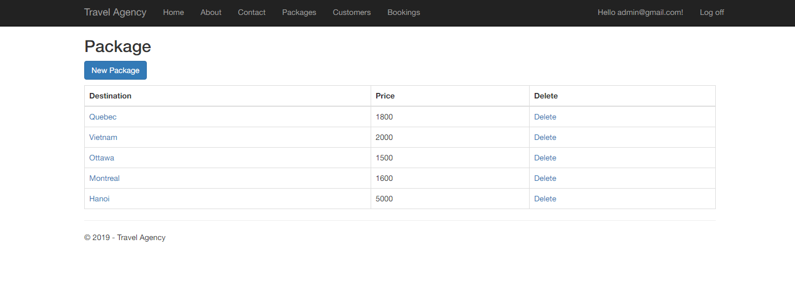

# Casey Trang Khuc code porfolio
This is my final project with ASP.NET MVC course in school.
The project includes:
- Implement CRUD operations
- Build forms with validation 
- Build RESTful services using ASP.NET Web API
- Use Entity Framework code-first workflow to build a model 
- Implement security, authentication and authorization using ASP.NET Identity
- Use powerful jQuery plugins
- Optimize application's performance  

### Used langugages
**Front-end:** HTML, CSS, JavaScript
**Back-end:** C#

